# EmoVRTouch

El control de emociones en personas con trastornos del espectro autista es de gran importancia para su desarrollo social. 
Se propone el desarrollo de un modelo experimental para evaluar los estímulos sensoriales a los que son más receptivos usando 
realidad virtual y un traje háptico (OWO).  

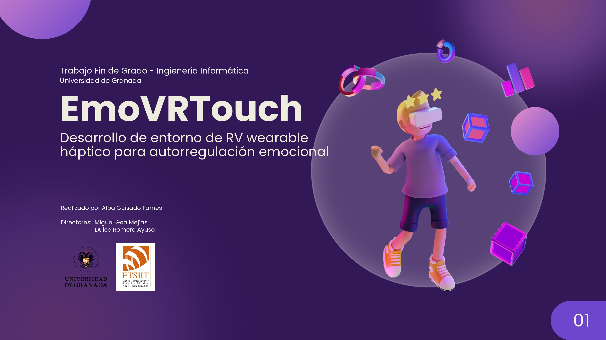
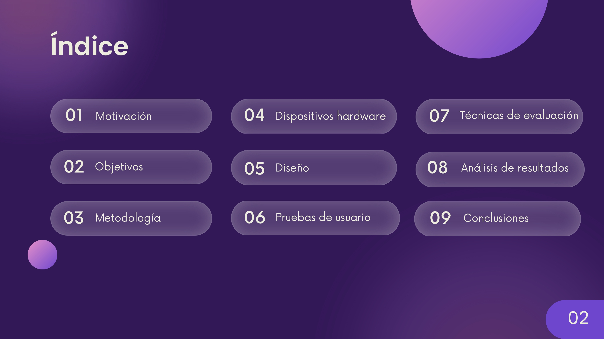
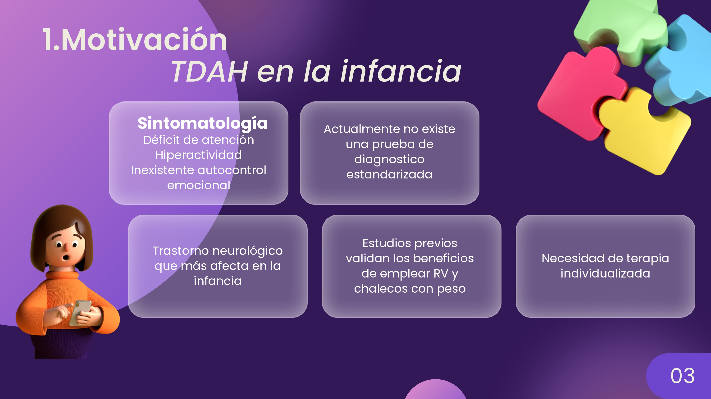
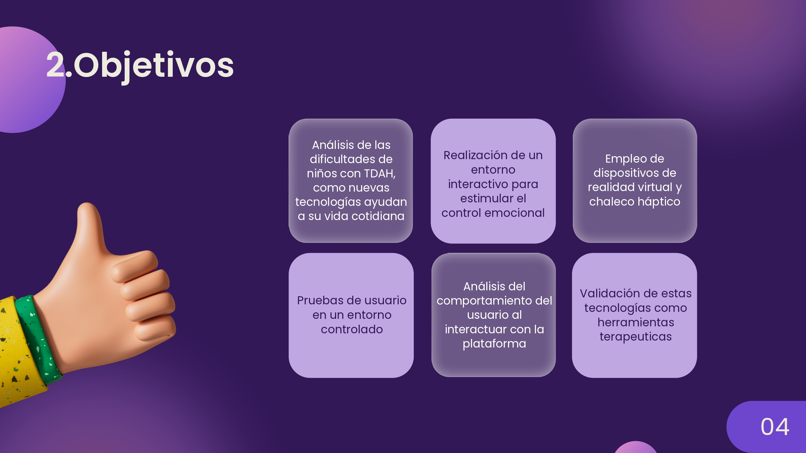
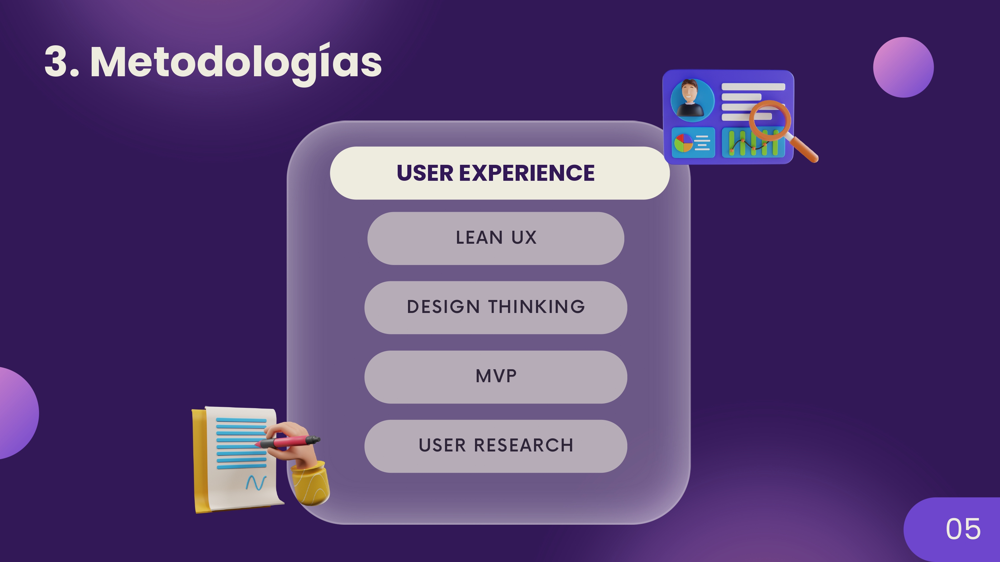
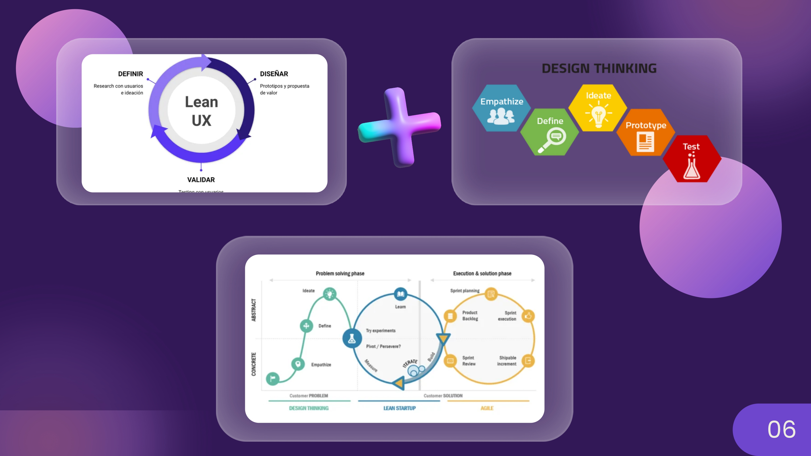
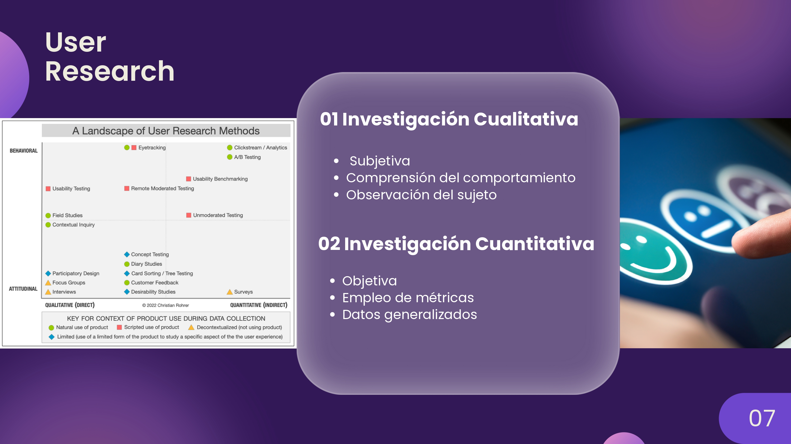
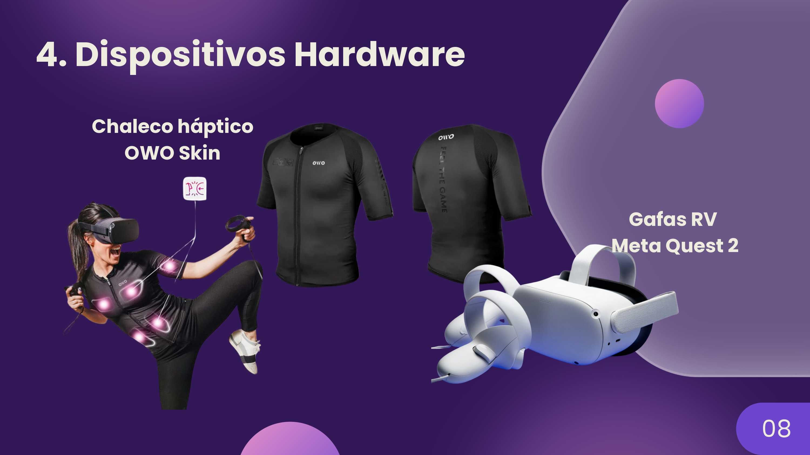
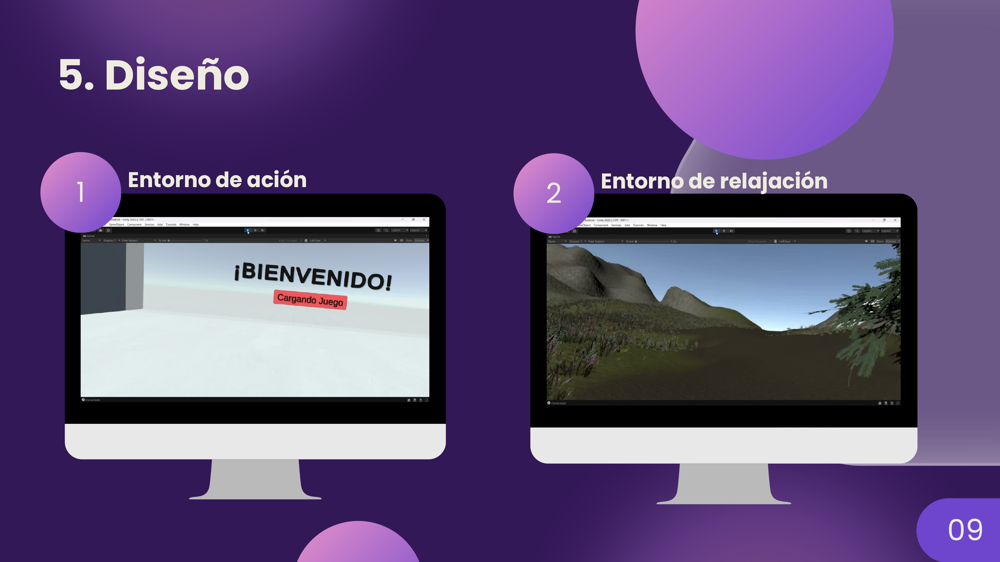
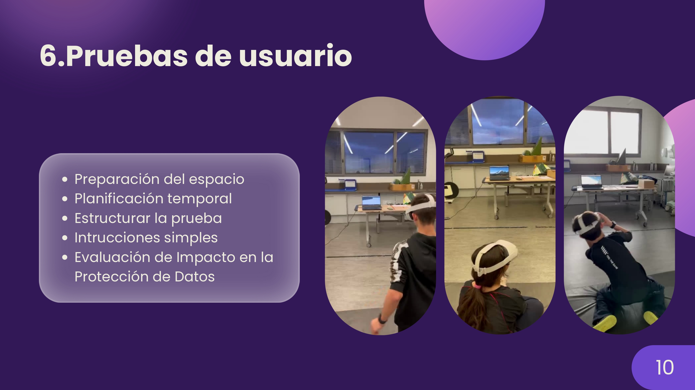
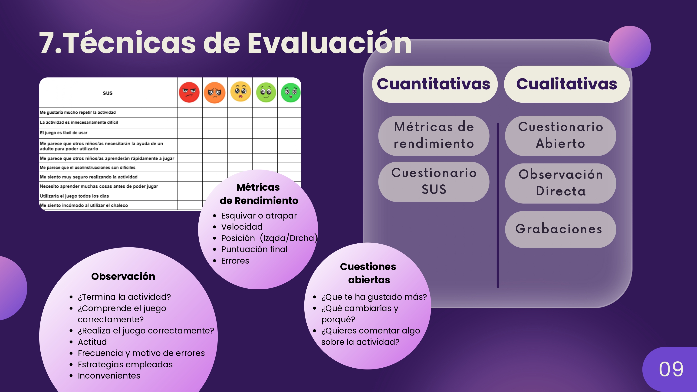
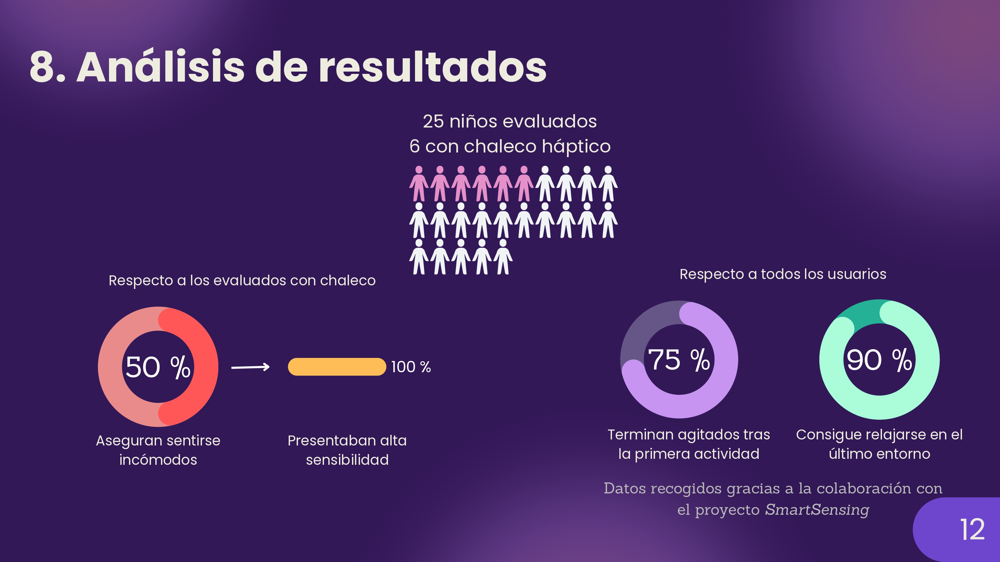
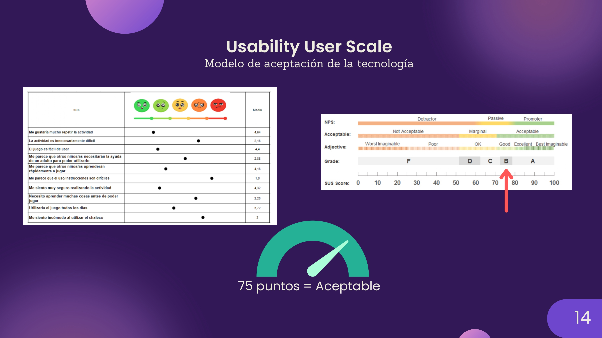
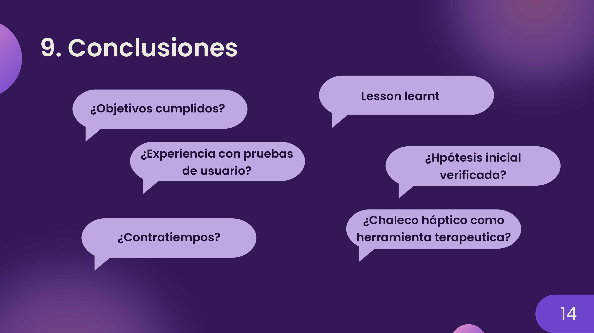
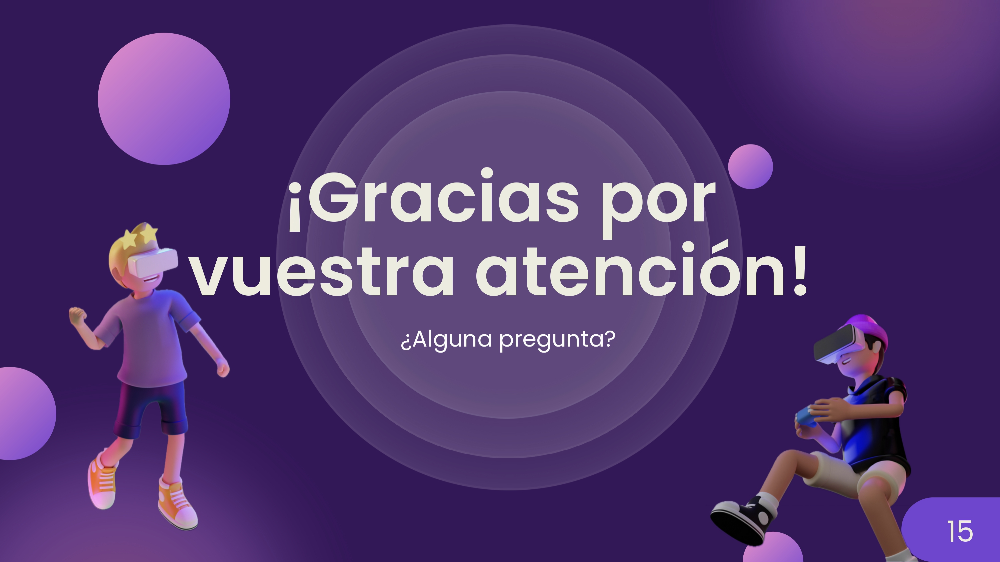
